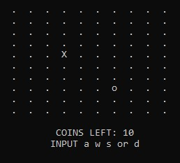

# Jogo de Coleta
Este é um jogo desenvolvido em C, utilizando matrizes. O objetivo é controlar o caractere "X" (Jogador) para coletar as moedas representadas pelo caractere "O" no tabuleiro (matriz), movimentando-se de forma estratégica e interativa.

## 🛠️ Construído com

*  Linguagem C
## ✒️ Autores

* **Línicker Ostroski Mota** 
